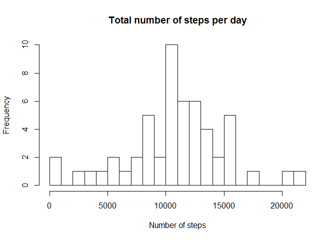
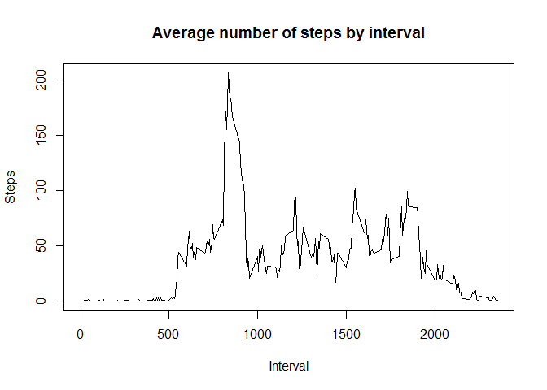
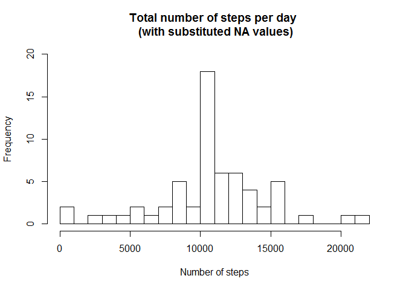
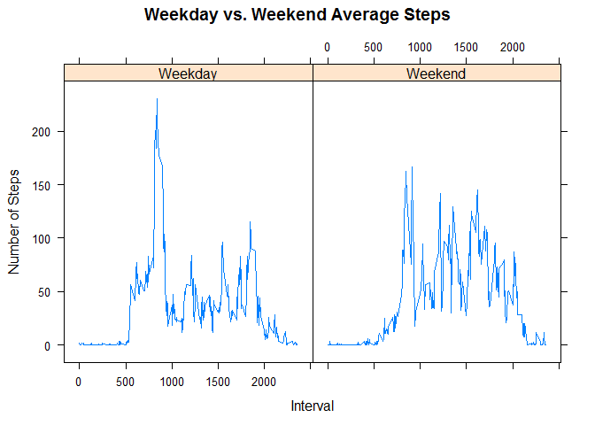

# Reproducible Research: Peer Assessment 1
February 9, 2017  

## Loading and preprocessing the data
First, we set the working directory.


```r
setwd("~/datasciencecoursera/RepData_PeerAssessment1")
```
Then, for good measure, we check to see if the lattice package is installed (to be used in a later part of the assignment). If necessary, the we install the r lattice package and call r library(lattice).


```r
if (!("lattice" %in% rownames(installed.packages()))) {
    install.packages("lattice")
}
library(lattice)
```

```
## Warning: package 'lattice' was built under R version 3.2.5
```

Again, for good measure, configure the plot area. 

```r
par(mfrow = c(1, 1))
```

#### 1. Load the data (even though the data supposedly exists in the repository, we download it again for good measure). 
*Note that the NA strings are "NA", and the dataset has a header.*

```r
file_url <- "https://d396qusza40orc.cloudfront.net/repdata%2Fdata%2Factivity.zip"
download.file(file_url, "data.zip")
unzip("data.zip")

dat <- read.csv("activity.csv", header = TRUE, na.strings = "NA")
```

#### 2. The date information is stored in a character string, so transform the date to a *date* format.

```r
dat$date <- as.Date(dat$date)
```

## What is mean total number of steps taken per day?
*Note that for this part of the assignment, we ignore the missing values in the dataset.*

#### 1. Calculate the total number of steps taken per day

```r
steps_by_day <- aggregate(steps ~ date, data = dat, sum, na.rm = TRUE)
```

#### 2. Make a histogram of the total number of steps taken each day

```r
hist(steps_by_day$steps, breaks = 20, xlab = "Number of steps", 
      main = "Total number of steps per day")
```

<!-- -->

#### 3. Calculate and report the mean and median of the total number of steps taken per day.
The mean of the total number of steps taken per day is __mean = 10766.19__ and the median of the total number of steps taken per day is __median = 10765__.

```r
steps_mean <- mean(steps_by_day$steps)
steps_median <- median(steps_by_day$steps)
```


```r
steps_mean
```

```
## [1] 10766.19
```

```r
steps_median
```

```
## [1] 10765
```


## What is the average daily activity pattern?
#### 1. Make a time series plot (i.e. *type = "l"*) of the 5-minute interval (x-axis) and the number of steps taken, averaged across all days (y-axis). 

```r
avg_steps_interval <- aggregate(steps ~ interval, data = dat, mean, na.rm = TRUE)
plot(x = avg_steps_interval$interval, y = avg_steps_interval$steps, type = "l", 
     main = "Average number of steps by interval", 
     xlab = "Interval", ylab = "Steps")
```

<!-- -->

#### 2. Which 5-minute interval, on average across all the days in the dataset, contains the maximum number of steps?
The interval __2355__ contains the maximum number of steps, with __206__ on average.

```r
max_avg_steps_interval <- sapply(avg_steps_interval, max)
```


```r
max_avg_steps_interval
```

```
##  interval     steps 
## 2355.0000  206.1698
```

## Inputing missing values

#### 1. Calculate and report the total number of missing values in the dataset (i.e. the total number of rows with NAs.)
There are __2304__ missing values in the dataset.

```r
total_NA <- sum(is.na(dat))
```

```r
total_NA
```

```
## [1] 2304
```

#### 2. Devise a strategy for filling in all of the missing values in the dataset. The strategy does not need to be sophisticated. 

My strategy for filling in all of the missing values in the dataset involves matching the mean of the 5-minute interval for which the value is missing. 
First, note that only *steps* have missing values. Hence we do not need to worry about filling missing date or interval values. 

```r
steps_NA <- sum(is.na(dat$steps))
date_NA <- sum(is.na(dat$date))
interval_NA <- sum(is.na(dat$interval))
```

```r
steps_NA
```

```
## [1] 2304
```

```r
date_NA
```

```
## [1] 0
```

```r
interval_NA
```

```
## [1] 0
```

Then, the function *fill_NA* finds the matching interval in the *avg_steps_interval* (created in an earlier section) and returns the average number of steps.


```r
fill_NA <- function(x) {
    fill_row <- which(avg_steps_interval$interval == x$interval)
    avg_steps_interval[fill_row, 2]
}
```

#### 3. Create a new dataset that is equal to the original dataset but with the missing data filled in.

We create a new dataset, named *filled_dat*, and set it equal to the original dataset. Then, we call the fill_NA function on any rows with missing values, and assign the return value to the missing value in the new dataset. 


```r
filled_dat <- dat

for (i in 1:nrow(dat)) {
    if (is.na(dat[i, 1])) {
        filled_dat[i, 1] <- fill_NA(dat[i, ])
        filled_dat[i, 2:3] <- dat[i, 2:3]
    }
}
```

#### 4. Make a histogram of the total number of steps taken each day and calculate and report the mean and median total number of steps taken per day. Do these values differ from the estimates from the first part of the assignment? What is the impact of inputing missing data on the estimates of the total daily number of steps?


```r
filled_steps_by_day <- aggregate(steps ~ date, data = filled_dat, sum, na.rm = TRUE)
hist(filled_steps_by_day$steps, breaks = 20, ylim = c(0, 20), 
     xlab = "Number of steps", 
     main = "Total number of steps per day \n (with substituted NA values)")
```

<!-- -->

The mean of the total number of steps taken per day is __mean = 10766.19__ and the median of the total number of steps taken per day is __median = 10766.19__. 

```r
filled_steps_mean <- mean(filled_steps_by_day$steps)
filled_steps_median <- median(filled_steps_by_day$steps)
```

```r
filled_steps_mean
```

```
## [1] 10766.19
```

```r
filled_steps_median
```

```
## [1] 10766.19
```
The mean value is the same as the estimate from the first part of the assignment, but the median value is greater than the estimate from the first part of the assignment. 


```r
filled_steps_mean - steps_mean
```

```
## [1] 0
```

```r
filled_steps_median - steps_median
```

```
## [1] 1.188679
```
The mean value did not increase because in the first estimate, we ignored the missing values, and in the second estimate, we added the mean value of steps. However, since the missing values were not necessarily evenly distributed on each side of the middle of the dataset, the median changed. 

## Are there differences in activity patterns between weekdays and weekends?

#### 1. Create a new factor variable in the dataset with two levels - "weekday" and "weekend" indicating whether a given date is a weekday or weekend date.

*Note that the week days have values 0-6, starting with Sunday = 0.*


```r
filled_dat$week.day <- as.POSIXlt(filled_dat$date)$wday

for (i in 1:nrow(filled_dat)) {
    if (filled_dat$week.day[i] == 0 | filled_dat$week.day[i] == 6) {
        filled_dat$week.day[i] <- "Weekend"
    } else {
        filled_dat$week.day[i] <- "Weekday"
    }
}

filled_dat$week.day <- factor(filled_dat$week.day, levels = c("Weekday", "Weekend"))
```

#### 2. Make a panel plot containing a time series plot of the 5-minute interval (x-axis) and the average number of steps taken, averaged across all weekday days or weekend days (y-axis). 


```r
avg_steps_weekday_interval <- aggregate(steps ~ interval + week.day, 
                                        data = filled_dat, mean)

xyplot(steps ~ interval | week.day, data = avg_steps_weekday_interval, type = "l", 
       main = "Weekday vs. Weekend Average Steps", 
       xlab = "Interval", ylab = "Number of Steps")
```

<!-- -->


